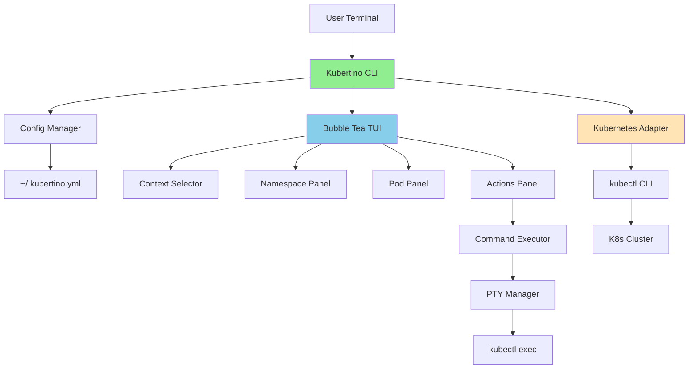
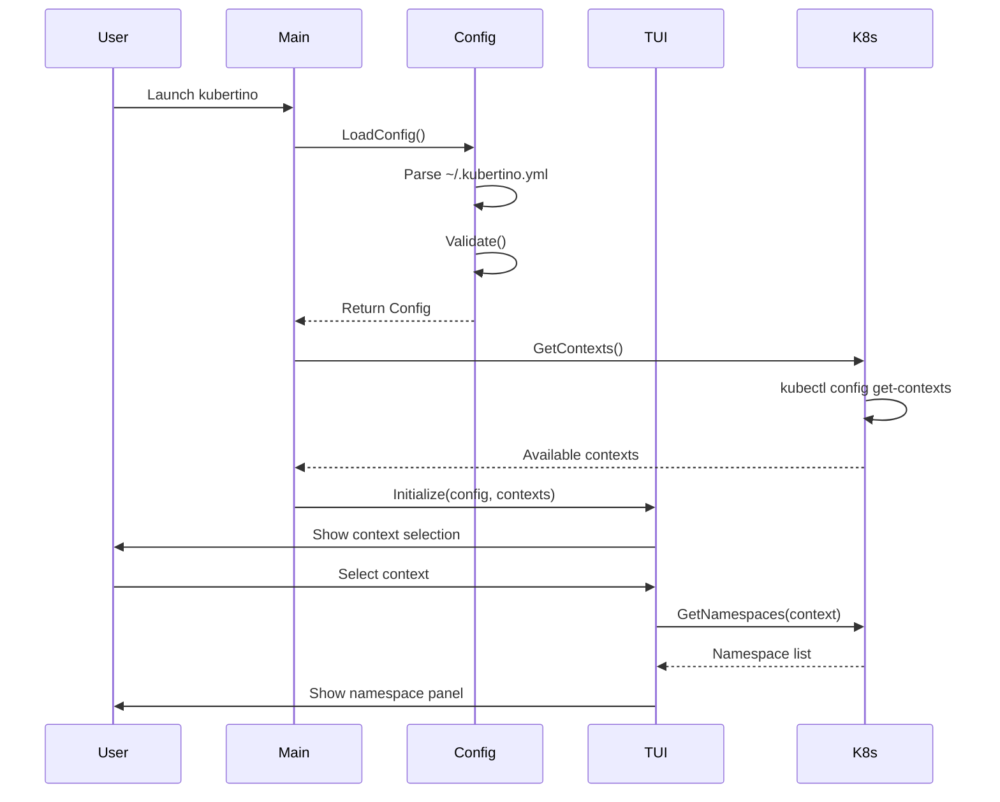
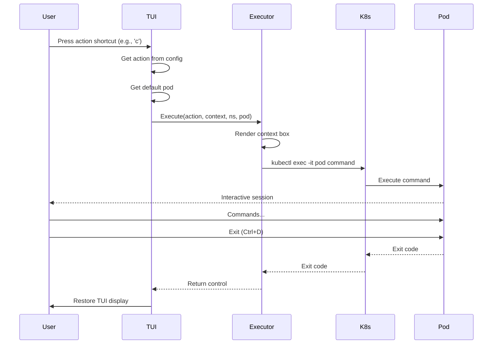

# Kubertino Architecture Document

## Introduction

This document outlines the technical architecture for Kubertino, a fast Kubernetes TUI tool built with Go and Bubble Tea. The primary goal is to provide a lazy-loading, highly performant alternative to k9s for developers working with large Kubernetes clusters.

**Relationship to PRD:**
All architectural decisions support the PRD requirements, particularly the performance NFRs (<1s startup, kubectl-level speed) and functional requirements (fuzzy search, configurable actions, split-pane UI).

### Change Log

| Date | Version | Description | Author |
|------|---------|-------------|---------|
| 2025-09-29 | 1.0 | Initial architecture | Architect |

## High Level Architecture

### Technical Summary

Kubertino is a single-binary CLI application built in Go using the Bubble Tea TUI framework. It employs a lazy-loading architecture, fetching Kubernetes data only for the selected namespace rather than all namespaces simultaneously. The application shells out to `kubectl` for Kubernetes operations, avoiding the complexity of client-go while maintaining native kubectl performance and compatibility. Configuration is managed via a YAML file (~/.kubertino.yml) with hot-reload capability. The split-pane UI is implemented as a composed Bubble Tea model with three independent panels. Interactive commands (pod exec) are executed by temporarily yielding terminal control to child processes.

### High Level Overview

**Architecture Style:** Monolithic CLI application with modular internal structure

**Repository Structure:** Single Go module (monorepo not needed for this scope)

**Primary User Flow:**
1. User launches kubertino
2. Application reads configuration and validates
3. User selects Kubernetes context (if multiple configured)
4. Application displays namespace list with fuzzy search
5. User selects namespace → pods and actions populate
6. User executes action via shortcut → TUI yields to command
7. On command exit, TUI resumes

**Key Architectural Decisions:**

1. **Shell out to kubectl** rather than use client-go
    - Rationale: Simpler, maintains exact kubectl behavior, reduces binary size, avoids API version complexity

2. **Lazy loading only selected namespace**
    - Rationale: Core performance requirement, avoids k9s bottleneck

3. **Composed Bubble Tea models**
    - Rationale: Each panel independent, testable, maintainable

4. **YAML configuration with validation**
    - Rationale: User-friendly, standard for CLI tools, supports complex nested structures

### High Level Project Diagram



### Architectural Patterns

**Repository Pattern:** Abstract kubectl interactions behind clean interface
- Rationale: Enables testing without actual cluster, allows future switch to client-go if needed

**Model-View-Update (Bubble Tea Pattern):** Unidirectional data flow for UI state
- Rationale: Required by Bubble Tea, provides predictable state management

**Command Pattern:** Actions encapsulated as executable commands with templating
- Rationale: Flexible action system, simple universal interface

**Template Pattern:** Action commands use Go template syntax for variable substitution ({{.context}}, {{.namespace}}, {{.pod}})
- Rationale: Maximum flexibility allowing users to define any command structure, eliminates need for action type distinction, supports kubectl exec, URLs, local scripts with single unified approach

## Tech Stack

### Technology Stack Table

| Category | Technology | Version | Purpose | Rationale |
|----------|-----------|---------|---------|-----------|
| **Language** | Go | 1.21+ | Primary development language | Fast compilation, excellent CLI tooling, cross-platform, strong stdlib |
| **TUI Framework** | Bubble Tea | 0.25+ | Terminal UI framework | Most mature Go TUI framework, active development, good docs |
| **Styling** | Lip Gloss | 0.9+ | TUI component styling | Official companion to Bubble Tea, declarative styles |
| **YAML Parser** | gopkg.in/yaml.v3 | 3.0+ | Configuration parsing | Standard Go YAML library, good error messages |
| **Fuzzy Search** | github.com/sahilm/fuzzy | 0.1+ | Namespace filtering | Fast, simple API, good match highlighting |
| **K8s Interaction** | kubectl CLI | User's version | Kubernetes operations | Simplicity, exact kubectl behavior, no API versioning issues |
| **Testing** | Go stdlib testing | Built-in | Unit tests | Standard Go testing, no additional dependencies |
| **Testing Mocks** | github.com/stretchr/testify | 1.8+ | Test assertions and mocks | Industry standard, clean API |
| **Build Tool** | GoReleaser | 1.22+ | Cross-compilation and releases | Automates builds for multiple platforms, GitHub releases integration |
| **Linter** | golangci-lint | 1.55+ | Code quality | Comprehensive linter suite, catches common issues |

## Data Models

### Configuration Model

**Purpose:** Represents the complete user configuration from ~/.kubertino.yml

**Key Attributes:**
- `Version`: string - Config file format version
- `Kubeconfig`: string - Optional override for kubeconfig path
- `Actions`: []Action - Global actions available for all contexts
- `Favorites`: interface{} - Favorite namespaces (supports two formats: map[string][]string or []string)
- `Contexts`: []Context - List of Kubernetes contexts with their settings

**Relationships:**
- Root configuration contains global Actions and Favorites
- Each Context can define additional Actions that extend/override global ones
- Favorites can be either per-context (map) or global (list)

**Go Data Models:**

```go
type Config struct {
    Version    string      `yaml:"version"`
    Kubeconfig string      `yaml:"kubeconfig,omitempty"`        // Optional kubeconfig path override
    Actions    []Action    `yaml:"actions,omitempty"`           // Global actions for all contexts
    Favorites  interface{} `yaml:"favorites,omitempty"`         // map[string][]string OR []string
    Contexts   []Context   `yaml:"contexts"`
}

type Context struct {
    Name              string   `yaml:"name"`
    DefaultPodPattern string   `yaml:"default_pod_pattern,omitempty"`
    Actions           []Action `yaml:"actions,omitempty"` // Per-context actions (extend/override global)
}

type Action struct {
    Name        string `yaml:"name"`
    Shortcut    string `yaml:"shortcut"`
    Command     string `yaml:"command"`                   // Template with {{.context}}, {{.namespace}}, {{.pod}}
    PodPattern  string `yaml:"pod_pattern,omitempty"`     // Optional pod regex override
    Container   string `yaml:"container,omitempty"`       // Optional container name for multi-container pods
    Destructive bool   `yaml:"destructive,omitempty"`     // Requires confirmation (optional)
}
```

**Key Changes from Previous Version:**
- **Removed:** `Action.Type` field (pod_exec, url, local) - unified into template-based commands
- **Removed:** `Action.URL` field - URLs now in `Command` field (e.g., `command: "open https://..."`)
- **Removed:** `Context.FavoriteNamespaces` - moved to top-level `Config.Favorites`
- **Added:** `Config.Actions` - global actions shared across contexts
- **Added:** `Config.Favorites` - supports dual format (per-context map or global list)
- **Added:** `Context.Actions` - per-context actions that extend/override global

### Application State Model

**Purpose:** Runtime state of the application managed by Bubble Tea

**Key Attributes:**
- `CurrentContext`: *Context - Selected Kubernetes context
- `CurrentNamespace`: string - Selected namespace
- `Namespaces`: []string - List of namespaces in current context
- `Pods`: []Pod - Pods in current namespace
- `FocusedPanel`: PanelType - Which panel has keyboard focus
- `SearchMode`: bool - Whether namespace search is active
- `SearchQuery`: string - Current search text

**Relationships:**
- Application state references loaded Config
- State updates trigger UI re-renders

```go
type AppModel struct {
    config            *Config
    currentContext    *Context
    currentNamespace  string
    namespaces        []Namespace
    filteredNamespaces []Namespace
    pods              []Pod
    focusedPanel      PanelType
    searchMode        bool
    searchQuery       string
    err               error
}

type Namespace struct {
    Name       string
    IsFavorite bool
}

type Pod struct {
    Name   string
    Status string
}

type PanelType int
const (
    PanelNamespaces PanelType = iota
    PanelPods
    PanelActions
)
```

## Components

### CLI Entry Point

**Responsibility:** Application initialization, configuration loading, error handling

**Key Interfaces:**
- `main()` - Entry point, orchestrates startup
- `LoadConfig() (*Config, error)` - Loads and validates configuration
- `ValidateConfig(*Config) error` - Validates configuration

**Dependencies:**
- Config package for YAML parsing
- TUI package for Bubble Tea initialization

**Technology Stack:** Pure Go, uses stdlib flag package for CLI args

### Configuration Manager

**Responsibility:** YAML parsing, validation, hot-reload support

**Key Interfaces:**
- `Parse(filename string) (*Config, error)` - Parse YAML file
- `Validate(*Config) error` - Validate configuration rules
- `Watch(filename string, callback func()) error` - Watch file for changes (future)

**Dependencies:** gopkg.in/yaml.v3

**Implementation Notes:**
- Validation rules: unique shortcuts per context, valid regex patterns, required fields
- Error messages include line numbers from YAML
- Caching of parsed regex patterns for performance

### Kubernetes Adapter

**Responsibility:** Abstract kubectl interactions, provide clean API for TUI

**Key Interfaces:**
- `GetContexts() ([]string, error)` - List available contexts
- `GetNamespaces(context string) ([]string, error)` - List namespaces
- `GetPods(context, namespace string) ([]Pod, error)` - List pods
- `ExecInPod(context, namespace, pod, command string) error` - Execute command in pod

**Dependencies:** os/exec for shelling out to kubectl

**Technology Stack:**
- Shells out to kubectl binary
- Parses JSON output using encoding/json

**Implementation:**
```go
type KubeAdapter struct {
    kubectlPath string // Path to kubectl binary
}

func (k *KubeAdapter) GetNamespaces(context string) ([]string, error) {
    cmd := exec.Command(k.kubectlPath, "--context", context, "get", "namespaces", "-o", "json")
    output, err := cmd.Output()
    // Parse JSON, extract namespace names
    return namespaces, err
}
```

### TUI Controller

**Responsibility:** Main Bubble Tea model, coordinates panel models

**Key Interfaces:**
- `Init() tea.Cmd` - Bubble Tea initialization
- `Update(tea.Msg) (tea.Model, tea.Cmd)` - Handle messages
- `View() string` - Render complete UI

**Dependencies:**
- Bubble Tea framework
- Panel models (namespace, pod, action)
- Kubernetes adapter

**Implementation Notes:**
- Composes three panel models
- Routes keyboard events to focused panel
- Manages global state (context, namespace selection)
- Handles panel focus switching (Tab key)

### Panel Models

**Namespace Panel Model**

**Responsibility:** Display and filter namespace list

**Key Interfaces:**
- `Update(tea.Msg) (tea.Model, tea.Cmd)` - Handle input
- `View() string` - Render namespace list

**State:**
- Full namespace list
- Filtered list (during search)
- Selected index
- Search query

**Pod Panel Model**

**Responsibility:** Display pod list for selected namespace

**Key Interfaces:**
- `SetPods([]Pod)` - Update pod list
- `View() string` - Render pod list

**State:**
- Pod list
- Default pod indicator

**Actions Panel Model**

**Responsibility:** Display available actions with shortcuts

**Key Interfaces:**
- `SetActions([]Action)` - Update action list
- `ExecuteAction(shortcut string) error` - Trigger action execution
- `View() string` - Render actions list

**State:**
- Action list from config
- Action execution state

### Command Executor

**Responsibility:** Execute action commands with template variable substitution, manage terminal state during execution

**Key Interfaces:**
- `Execute(action Action, context Context, namespace, pod string) error` - Parse template, substitute variables, execute command

**Template Variables:**
- `{{.context}}` - Current Kubernetes context name
- `{{.namespace}}` - Selected namespace
- `{{.pod}}` - Matched pod name (using pod_pattern regex)

**Dependencies:**
- text/template for Go template parsing
- os/exec for command execution
- Terminal management via tea.ExecProcess

**Implementation:**
```go
type Executor struct {
    kubeAdapter *KubeAdapter
}

func (e *Executor) Execute(action Action, context Context, namespace, pod string) error {
    // 1. Parse command template
    tmpl, err := template.New("action").Parse(action.Command)
    if err != nil {
        return fmt.Errorf("invalid command template: %w", err)
    }

    // 2. Substitute template variables
    data := map[string]string{
        "context":   context.Name,
        "namespace": namespace,
        "pod":       pod,
    }

    var buf bytes.Buffer
    if err := tmpl.Execute(&buf, data); err != nil {
        return fmt.Errorf("template execution failed: %w", err)
    }

    command := buf.String()

    // 3. Show context box
    fmt.Println(renderContextBox(context.Name, namespace, pod, action.Name))

    // 4. Execute command with shell
    // Note: Using sh -c allows complex commands with pipes, redirects, etc.
    cmd := exec.Command("sh", "-c", command)
    cmd.Stdin = os.Stdin
    cmd.Stdout = os.Stdout
    cmd.Stderr = os.Stderr

    return cmd.Run()
}
```

**Example Template Substitutions:**

| Template Command | Substituted Command (context=prod, ns=app, pod=web-123) |
|-----------------|----------------------------------------------------------|
| `kubectl logs -n {{.namespace}} {{.pod}}` | `kubectl logs -n app web-123` |
| `open https://dash/{{.context}}/{{.namespace}}` | `open https://dash/prod/app` |
| `kubectl exec -n {{.namespace}} {{.pod}} -it -- bash` | `kubectl exec -n app web-123 -it -- bash` |

## Core Workflows

### Startup and Context Selection Flow



### Action Execution Flow



## Source Tree

```
kubertino/
├── cmd/
│   └── kubertino/
│       └── main.go                 # Entry point, CLI setup
│
├── internal/                       # Private application code
│   ├── config/
│   │   ├── config.go              # Config structures
│   │   ├── parser.go              # YAML parsing
│   │   └── validator.go           # Config validation
│   │
│   ├── k8s/
│   │   ├── adapter.go             # Kubernetes adapter interface
│   │   ├── kubectl.go             # kubectl shell-out implementation
│   │   └── types.go               # K8s data types (Pod, Namespace)
│   │
│   ├── tui/
│   │   ├── app.go                 # Main Bubble Tea application
│   │   ├── panels/
│   │   │   ├── namespaces.go     # Namespace panel model
│   │   │   ├── pods.go           # Pod panel model
│   │   │   └── actions.go        # Actions panel model
│   │   ├── styles/
│   │   │   └── styles.go         # Lip Gloss styles
│   │   └── keys.go               # Keyboard bindings
│   │
│   ├── executor/
│   │   ├── executor.go           # Command execution logic
│   │   ├── pod_exec.go           # Pod exec handler
│   │   ├── local.go              # Local command handler
│   │   └── url.go                # URL handler
│   │
│   └── search/
│       └── fuzzy.go              # Fuzzy search implementation
│
├── pkg/                           # Public libraries (if needed later)
│
├── examples/
│   └── kubertino.yml.example     # Example configuration
│
├── docs/
│   ├── prd.md                    # Product Requirements
│   └── architecture.md           # This document
│
├── scripts/
│   └── install.sh                # Installation script
│
├── .goreleaser.yml               # GoReleaser configuration
├── .golangci.yml                 # Linter configuration
├── go.mod                        # Go module definition
├── go.sum                        # Dependency checksums
├── Makefile                      # Build targets
└── README.md                     # User documentation
```

## Infrastructure and Deployment

### Build and Compilation

**Tool:** GoReleaser

**Build Command:** `go build -o kubertino cmd/kubertino/main.go`

**Cross-compilation targets:**
- linux/amd64
- linux/arm64
- darwin/amd64 (Intel Mac)
- darwin/arm64 (Apple Silicon)

**Build flags:**
```bash
-ldflags="-s -w -X main.version={{.Version}} -X main.commit={{.Commit}}"
```
- `-s -w`: Strip debug info, reduce binary size
- `-X`: Inject version and commit info

### Deployment Strategy

**Primary Distribution:** GitHub Releases

**Installation Methods:**

1. **Homebrew (macOS/Linux):**
```bash
brew tap yourusername/kubertino
brew install kubertino
```

2. **Direct download:**
```bash
curl -L https://github.com/yourusername/kubertino/releases/latest/download/kubertino_$(uname -s)_$(uname -m).tar.gz | tar xz
sudo mv kubertino /usr/local/bin/
```

3. **Go install:**
```bash
go install github.com/yourusername/kubertino/cmd/kubertino@latest
```

### Environments

**Development:**
- Local machine with kubectl configured
- Test Kubernetes cluster (minikube/kind)

**Production:**
- User's local machine
- No server-side deployment needed

### CI/CD Pipeline

**Platform:** GitHub Actions

**Pipeline stages:**

1. **Test:** Run unit tests, linters
2. **Build:** Cross-compile for all platforms
3. **Release:** Create GitHub release with binaries (on tag push)

**`.github/workflows/release.yml`:**
```yaml
name: Release
on:
  push:
    tags:
      - 'v*'
jobs:
  goreleaser:
    runs-on: ubuntu-latest
    steps:
      - uses: actions/checkout@v3
      - uses: actions/setup-go@v4
        with:
          go-version: 1.21
      - uses: goreleaser/goreleaser-action@v5
        with:
          version: latest
          args: release --clean
        env:
          GITHUB_TOKEN: ${{ secrets.GITHUB_TOKEN }}
```

## Error Handling Strategy

### General Approach

**Error Model:** Go standard error handling with wrapped errors

**Error Propagation:** Errors bubble up through call stack with context added at each layer

### Logging Standards

**Library:** Go stdlib `log/slog` (structured logging)

**Format:** JSON for file logging, human-readable for stderr

**Levels:**
- DEBUG: Detailed trace information
- INFO: General informational messages
- WARN: Warning messages (non-blocking issues)
- ERROR: Error messages (operations failed)

**Log location:** `~/.kubertino/logs/kubertino.log`

**Required Context:**
- Timestamp (automatic)
- Log level
- Context (which operation/component)
- Error details

**Example:**
```go
slog.Error("failed to fetch namespaces",
    "context", ctx.Name,
    "error", err)
```

### Error Handling Patterns

**Configuration Errors:**
```go
// Clear user-facing message with fix suggestions
if err := config.Validate(); err != nil {
    return fmt.Errorf("configuration validation failed: %w\n\nCheck ~/.kubertino.yml:\n%s", err, err.Hints())
}
```

**Kubernetes Operation Errors:**
```go
// Distinguish between different failure modes
namespaces, err := k8s.GetNamespaces(ctx)
if err != nil {
    if errors.Is(err, ErrPermissionDenied) {
        return fmt.Errorf("RBAC permission denied for context %s: check your cluster access", ctx)
    }
    if errors.Is(err, ErrTimeout) {
        return fmt.Errorf("timeout connecting to cluster %s: check network/VPN", ctx)
    }
    return fmt.Errorf("failed to fetch namespaces: %w", err)
}
```

**Action Execution Errors:**
```go
// Non-blocking errors return to TUI
if err := executor.Execute(action); err != nil {
    // Show error in TUI, don't exit application
    model.err = fmt.Errorf("action '%s' failed: %w", action.Name, err)
    return model, nil
}
```

### Error Types

**Custom error types for common scenarios:**

```go
var (
    ErrConfigNotFound     = errors.New("config file not found")
    ErrInvalidConfig      = errors.New("invalid configuration")
    ErrContextNotFound    = errors.New("context not found")
    ErrNamespaceNotFound  = errors.New("namespace not found")
    ErrPodNotFound        = errors.New("pod not found")
    ErrPermissionDenied   = errors.New("permission denied")
    ErrTimeout            = errors.New("operation timeout")
    ErrKubectlNotFound    = errors.New("kubectl not found in PATH")
)
```

## Coding Standards

### Core Standards

**Languages & Runtimes:** Go 1.21+

**Style & Linting:**
- `gofmt` for formatting (enforced)
- `golangci-lint` with default rules plus:
    - `gocyclo`: Max complexity 15
    - `goconst`: Detect repeated strings
    - `misspell`: Catch typos

**Test Organization:**
- `*_test.go` files next to implementation
- Table-driven tests preferred
- Mocks in `internal/mocks/` directory

### Naming Conventions

| Element | Convention | Example |
|---------|-----------|---------|
| Packages | lowercase, single word | `config`, `executor` |
| Files | lowercase, underscores | `pod_exec.go`, `fuzzy_search.go` |
| Types | PascalCase | `Config`, `KubeAdapter` |
| Functions | PascalCase (exported), camelCase (private) | `GetNamespaces()`, `parseYAML()` |
| Constants | PascalCase or ALL_CAPS | `DefaultTimeout`, `MAX_RETRIES` |
| Interfaces | PascalCase, often -er suffix | `Executor`, `Parser` |

### Critical Rules

**Never use global mutable state** - Pass dependencies explicitly through constructors

**Always validate external input** - Configuration, kubectl output, user input

**Wrap errors with context** - Use `fmt.Errorf("context: %w", err)` pattern

**Close resources in defer** - File handles, connections must be cleaned up

**Test exported functions** - All public APIs must have tests

## Test Strategy and Standards

### Testing Philosophy

**Approach:** Test-after development for MVP (pragmatic given time constraints)

**Coverage Goals:** 70%+ for critical paths (config, k8s adapter, executor)

### Test Types and Organization

**Unit Tests:**

**Framework:** Go stdlib `testing` package

**File Convention:** `filename_test.go` alongside `filename.go`

**Location:** Same package as implementation (`internal/config/config_test.go`)

**Mocking Library:** `testify/mock` for interfaces

**Coverage Requirement:** 70% minimum for `internal/` packages

**Example:**
```go
func TestConfigValidation(t *testing.T) {
    tests := []struct {
        name    string
        config  *Config
        wantErr bool
    }{
        {
            name: "valid config",
            config: &Config{
                Version: "1.0",
                Contexts: []Context{{Name: "test", DefaultPodPattern: ".*"}},
            },
            wantErr: false,
        },
        {
            name: "duplicate shortcuts",
            config: &Config{
                Contexts: []Context{{
                    Actions: []Action{
                        {Shortcut: "c", Name: "console"},
                        {Shortcut: "c", Name: "bash"},
                    },
                }},
            },
            wantErr: true,
        },
    }
    
    for _, tt := range tests {
        t.Run(tt.name, func(t *testing.T) {
            err := ValidateConfig(tt.config)
            if (err != nil) != tt.wantErr {
                t.Errorf("ValidateConfig() error = %v, wantErr %v", err, tt.wantErr)
            }
        })
    }
}
```

**Integration Tests:**

**Scope:** kubectl interaction, end-to-end flows

**Location:** `internal/k8s/integration_test.go`

**Test Infrastructure:**
- Requires local Kubernetes cluster (minikube/kind)
- Skipped in CI if cluster not available: `if testing.Short() { t.Skip() }`

**Example:**
```go
func TestKubectlAdapter_GetNamespaces(t *testing.T) {
    if testing.Short() {
        t.Skip("skipping integration test")
    }
    
    adapter := NewKubectlAdapter()
    namespaces, err := adapter.GetNamespaces("minikube")
    
    require.NoError(t, err)
    assert.Contains(t, namespaces, "default")
    assert.Contains(t, namespaces, "kube-system")
}
```

**Manual Testing:**

**Scope:** TUI behavior, visual appearance, keyboard interaction

**Test Scenarios:**
1. Startup with various config files (valid, invalid, missing)
2. Context selection and switching
3. Namespace search and filtering
4. Action execution (all types: pod_exec, url, local)
5. Error handling (pod not found, permission denied, timeout)
6. Terminal resize handling
7. Configuration hot-reload

**Manual Test Checklist:** `docs/manual-test-checklist.md`

### Test Data Management

**Strategy:** Fixtures for YAML configs, mock kubectl output

**Fixtures:** `internal/testdata/` directory
- `valid-config.yml`
- `invalid-config.yml`
- `kubectl-get-namespaces.json`
- `kubectl-get-pods.json`

**Factories:** Helper functions for creating test data

```go
func NewTestConfig() *Config {
    return &Config{
        Version: "1.0",
        Contexts: []Context{
            NewTestContext("test-context"),
        },
    }
}
```

### Continuous Testing

**CI Integration:** GitHub Actions

**CI Test Stages:**
1. Lint (golangci-lint)
2. Unit tests (with coverage report)
3. Integration tests (if cluster available)
4. Build verification

**Performance Tests:** Not required for MVP

**Security Tests:** `gosec` for security vulnerability scanning

## Security

### Input Validation

**Validation Library:** None needed, use Go stdlib validation

**Validation Location:** Config parsing and user input

**Required Rules:**
- YAML config validated on load (required fields, valid regex, unique shortcuts)
- Command injection prevention in action templates
- Path traversal prevention in kubeconfig paths

**Example:**
```go
func ValidateAction(a *Action) error {
    if a.Shortcut == "" || len(a.Shortcut) > 1 {
        return fmt.Errorf("shortcut must be single character")
    }
    if a.Type == "" {
        return fmt.Errorf("action type required")
    }
    if a.Type == "pod_exec" && a.Command == "" {
        return fmt.Errorf("pod_exec action requires command")
    }
    // Validate no command injection characters in templates
    if strings.ContainsAny(a.Command, ";|&") {
        return fmt.Errorf("command contains unsafe characters")
    }
    return nil
}
```

### Authentication & Authorization

**Auth Method:** Inherits from kubectl configuration

**Session Management:** N/A (stateless CLI tool)

**Required Patterns:**
- Use kubectl's existing authentication (kubeconfig)
- Respect RBAC permissions from cluster
- No custom authentication layer

### Secrets Management

**Development:** No secrets in application

**Production:** Kubeconfig credentials managed by kubectl

**Code Requirements:**
- Never log kubeconfig contents
- Never include credentials in error messages
- Use kubectl's credential handling

### API Security

**Rate Limiting:** N/A (kubectl handles this)

**CORS Policy:** N/A (not a web service)

**Security Headers:** N/A

**HTTPS Enforcement:** Inherits from kubectl/cluster config

### Data Protection

**Encryption at Rest:** Kubeconfig handled by kubectl

**Encryption in Transit:** HTTPS to Kubernetes API (kubectl responsibility)

**PII Handling:** No PII collected or stored

**Logging Restrictions:**
- Never log pod command output (may contain secrets)
- Never log full kubectl commands (may contain tokens)
- Never log kubeconfig file contents

### Dependency Security

**Scanning Tool:** `govulncheck` (Go vulnerability scanner)

**Update Policy:** Check dependencies monthly, update on security advisories

**Approval Process:** Review go.mod changes in PRs

### Security Testing

**SAST Tool:** `gosec` (Go security checker)

**DAST Tool:** Not applicable (CLI tool, not web service)

**Penetration Testing:** Not required for MVP

## Next Steps

This architecture document provides complete technical guidance for implementing Kubertino.

**Development Order:**

1. **Epic 1: Foundation** - Implement config parsing, CLI structure, basic TUI
2. **Epic 2: Navigation** - Context/namespace selection, fuzzy search
3. **Epic 3: Pods** - Pod listing and display
4. **Epic 4: Actions** - pod_exec implementation (core value)
5. **Epic 5: Extended** - URL/local actions, polish

**Ready for Implementation:**
- All architectural decisions made
- Technology stack defined
- Error handling patterns established
- Testing strategy clear
- Build/deployment approach defined

**Next Agent:** Product Owner (PO) to validate architecture against PRD using architect-checklist, then Scrum Master (SM) to begin story creation.